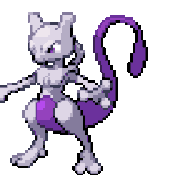
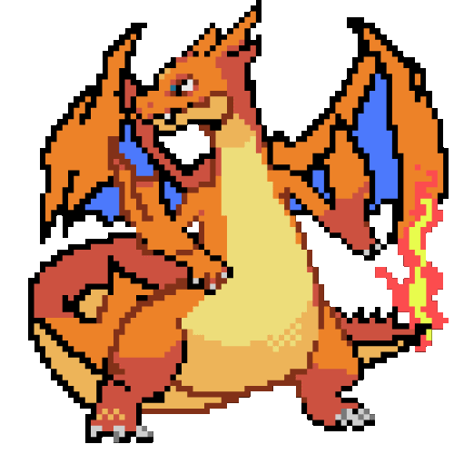
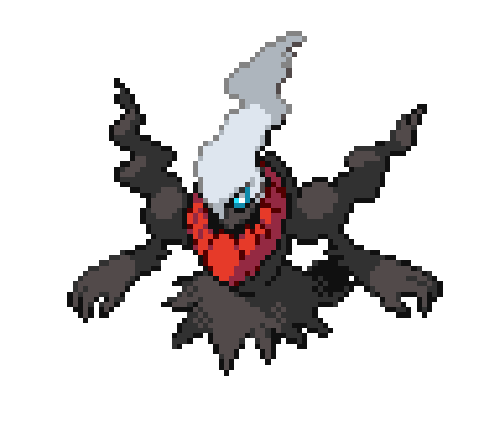

<h1 align="center"> 🐣 Hello, Ivan here. 👻</h2>
    

- 💻 A designer with front-end knowledge.
- 📚 Current student at BCIT.
- 🌧️ Enjoys rainy days.
- ⚡ Fun fact: A group of crows are called a murder. 
  
<h2>My Pokemon Team 🎮</h2>

  

  
    

<h2>🔨 Technologies & Tools</h2>

<a href="https://github.com/search?l=JavaScript&q=user%3Aitong6+language%3Anhtml&type=Repositories">
  <a href="https://github.com/search?l=JavaScript&q=user%3Aitong6+language%3Anhtml&type=Repositories">&nbsp;
  <a href="https://github.com/search?l=CSS&q=user%3Aitong6+language%3Anhtml&type=Repositories">&nbsp;
    <a href="https://github.com/search?l=HTML&q=user%3Aitong6+language%3Anhtml&type=Repositories">&nbsp;
      <a href="https://github.com/search?l=JavaScript&q=user%3Aitong6+language%3Anhtml&type=Repositories">&nbsp;

    

<h2>🤫 Shhhhh don't wake up Mew 😴 </h2> 

<!--
**MonikaSzucs/MonikaSzucs** is a ✨ _special_ ✨ repository because its README.md (this file) appears on your GitHub profile.

Here are some ideas to get you started:

- 🔭 I’m currently working on ...
- 🌱 I’m currently learning ...
- 👯 I’m looking to collaborate on ...
- 🤔 I’m looking for help with ...
- 💬 Ask me about ...
- 📫 How to reach me: ...
- 😄 Pronouns: ...
- ⚡ Fun fact: ...
-->

<!-- # Heading 1

[video test](https://www.youtube.com/watch?v=uSvAvCE9ztc) -->